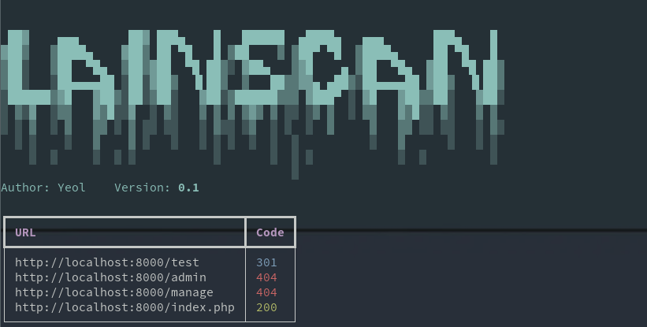

# LainScan
一个目录扫描工具，添加了一些我喜欢的功能，仅此而已。


## 安装
需要 Python 3.10 +
```commandline
git clone https://github.com/YEOLLL/LainScan/
cd LainScan
pip install -r requirements.txt
python lainscan.py --help
```

## 使用
### 打印帮助信息
```commandline
python lainscan.py --help
```
```commandline
Usage: lainscan.py [OPTIONS]

Options:
  -U, --url TEXT         需要扫描的URL  [required]
  -W, --words TEXT       字典文件路径  [required]
  -E, --ext TEXT         后缀名，默认为空
  -H, --header TEXT      自定义请求头
  -T, --timeout FLOAT    超时时间，包括建立连接到读取返回，单位：秒，默认：10.0
  --redirect             是否自动跳转，默认不跳转，开启后遇到 301 或 302 会返回跳转后的状态码
  --sleep-time FLOAT     请求间隔，开启后将不会并发执行，单位：秒
  --custom-code INTEGER  自定义返回状态码，默认：200 301 302 401 403
  --show-length          是否显示返回长度，如果开启则使用 GET 方法替代 HEAD，且启用自动跳转
  --help                 Show this message and exit.
```

### 必要参数
默认情况下只需指定必要的两个参数，`URL`和`字典路径`  

使用`-U`或`--url`指定`URL`，使用`-W`或`--words`指定`字典路径`
```commandline
python lainscan.py -U 'http://example.com/' -W './words.txt'
```

### 后缀名模式
通过使用`-E`或者`--ext`指定后缀名，程序会自动为字典条目添加后缀名  

比如想要测试目标站点下是否存在`admin.bak`，只需准备包含`admin`条目的字典，指定`-E '.bak'`
```commandline
python lainscan.py -U 'http://example.com/' -W './words.txt' -E '.bak'
```

### 间隔请求模式
默认情况下所有任务将并发执行，但有时遇到请求限制，可以设置`--sleep-time`来为每次扫描制造间隔
```commandline
python lainscan.py -U 'http://example.com/' -W './words.txt' --sleep_time 2
```

### 自定义请求头
程序自带默认的请求头，设置自定义请求头后，将会在此基础上替换或添加。

使用`-H`或`--header`参数，用`:`分割 key 和 value
```commandline
python lainscan.py -U 'http://example.com/' -W './words.txt' -H 'User-Agent:JustTest'
```
指定多个值
```commandline
python lainscan.py -U 'http://example.com/' -W './words.txt' -H 'User-Agent:JustTest' -H 'Referer:https://fauux.neocities.org/'
```

### 自定义超时时间
此超时时间是连接建立和内容读取的总超时，默认 10 秒  

使用`-T`或`--timeout`参数
```commandline
python lainscan.py -U 'http://example.com/' -W './words.txt' -T 3
```

### 自动跳转
默认遇到 301 或 302 时不进行跳转  

添加`--redirect`开启跳转
```commandline
python lainscan.py -U 'http://example.com/' -W './words.txt' --redirect
```
此时会返回跳转后的状态码

### 显示返回长度
默认只显示 URL 和 Code  

添加`--show-length`显示返回长度
```commandline
python lainscan.py -U 'http://example.com/' -W './words.txt' --show-length
```
注意：此时会使用`Get`方法替代默认的`HEAD`方法

### 自定义返回状态码
默认输出状态码为`200`、`301`、`302`、`401`、`403`的结果  

使用`--custom-code`参数添加自定义状态码
```commandline
python lainscan.py -U 'http://example.com/' -W './words.txt' --custom-code 404
```
指定多个值
```commandline
python lainscan.py -U 'http://example.com/' -W './words.txt' --custom-code 404 --custom-code 503
```

## TODO
* 请求异常捕获
* 根据返回状态启停
* 随机 UA
* 结果保存

## 致谢
[Dirscan](https://github.com/j3ers3/Dirscan) 为结果输出部分提供参考